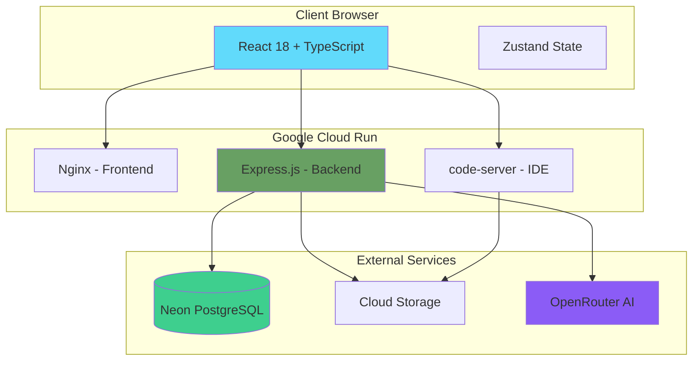
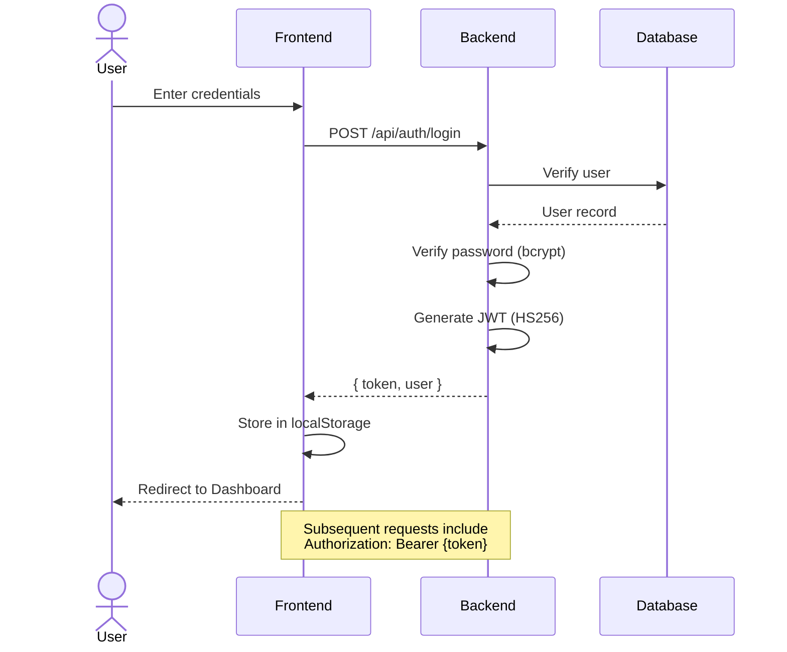
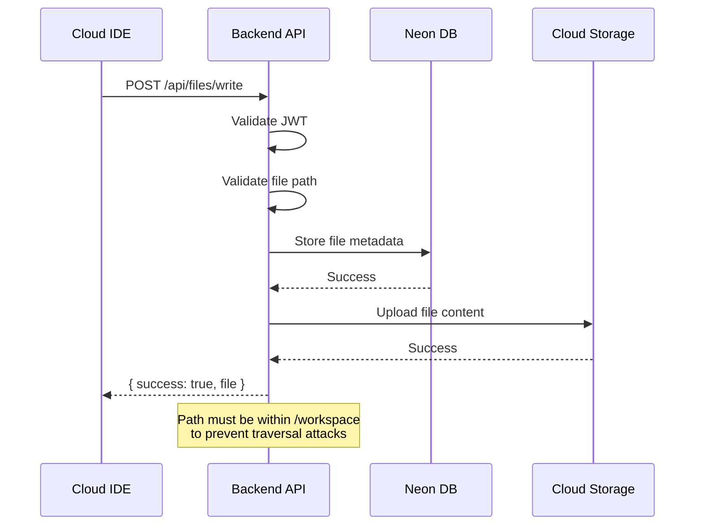
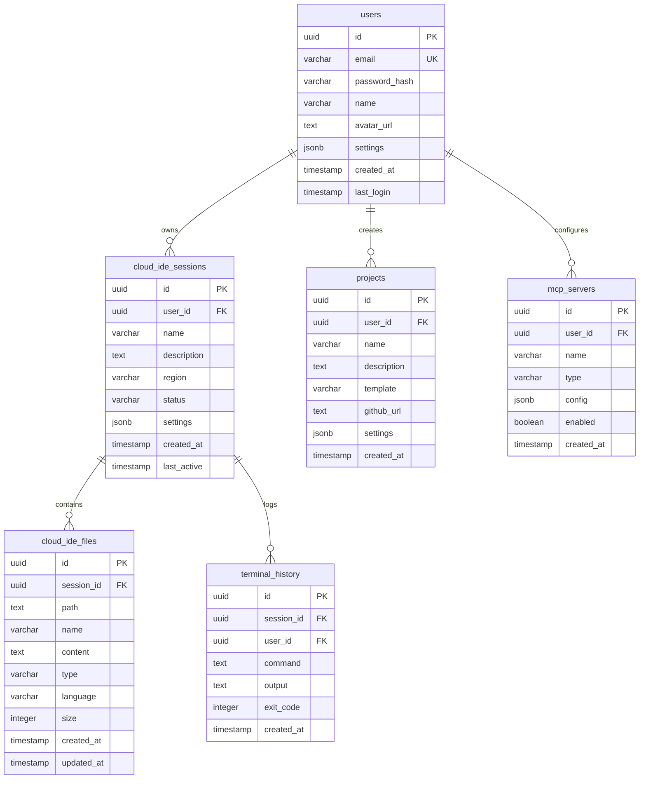
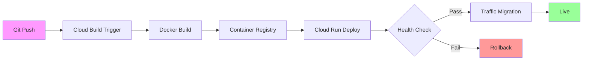
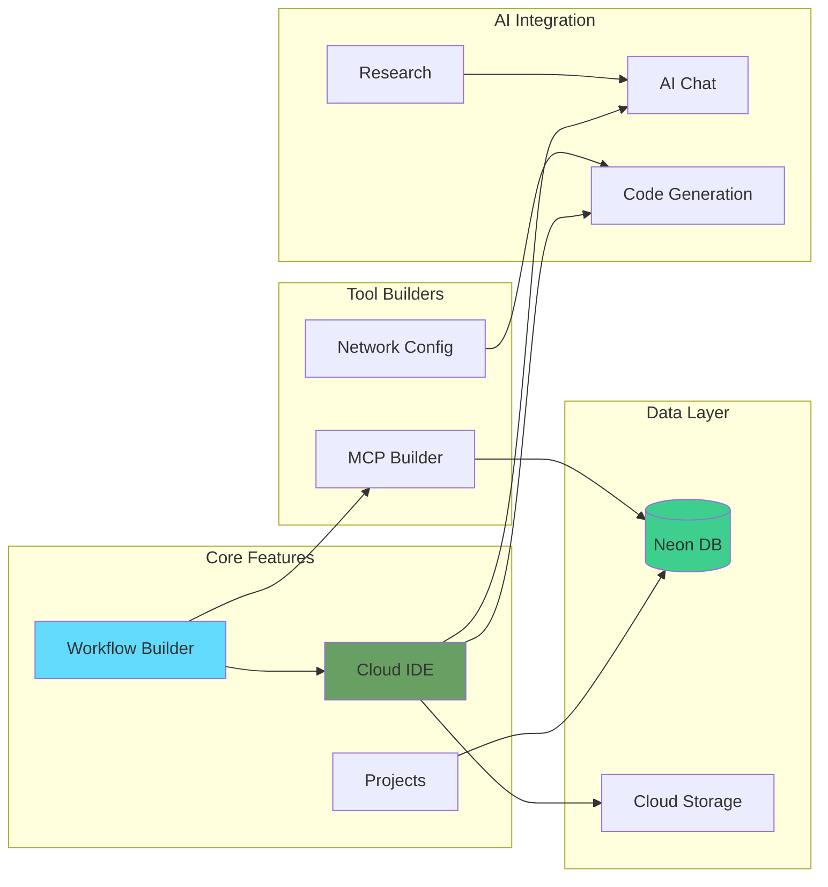

<div align="center">

# Agent Builder

**Build, Deploy, and Manage AI Agents with Visual Workflows**

[](LICENSE)
[](https://nodejs.org/)
[](https://www.typescriptlang.org/)
[](https://react.dev/)
[](https://cloud.google.com/run)

*A comprehensive platform for creating AI-powered agents with a visual workflow builder, cloud IDE, and MCP server integration.*

[Features](#features) | [Quick Start](#quick-start) | [Architecture](#architecture) | [API Reference](#api-reference) | [Deployment](#deployment)

</div>

---

## Overview

Agent Builder is a full-stack platform that enables developers to create, configure, and deploy AI agents through an intuitive visual interface. It combines a powerful workflow builder with a cloud-based IDE, multiple AI model integrations, and Model Context Protocol (MCP) server capabilities.

### Key Highlights

- **Visual Workflow Builder** - Drag-and-drop interface for creating agent workflows
- **Cloud IDE** - VS Code in the browser with real-time file sync
- **Multi-Model AI** - Integration with Claude, GPT-4, Gemini via OpenRouter
- **MCP Server Builder** - Create custom Model Context Protocol servers
- **Network Automation** - Generate configurations for Cisco, Juniper devices
- **AI-Powered Research** - Built-in research tools with citation support
- **GitHub Integration** - 96 specialized MCP tools for repository management

---

## Architecture

### System Overview



### Authentication Flow



### File Operations Flow



### Database Schema



### Deployment Pipeline



### Feature Architecture



---

## Features

### Visual Workflow Builder
Create complex agent workflows with a node-based canvas:
- **Agent Nodes** - Configure AI agents with custom prompts
- **Action Nodes** - Define executable actions and triggers
- **Logic Nodes** - Add conditional branching and loops
- **MCP Nodes** - Integrate Model Context Protocol servers
- **Network Nodes** - Automate network device configurations

### Cloud IDE
Full-featured VS Code environment in your browser:
- Syntax highlighting for 50+ languages
- Integrated terminal with command history
- File explorer with drag-and-drop
- Real-time file synchronization
- Pre-installed extensions (Python, ESLint, Prettier, Tailwind)

### AI Integration
Connect to multiple AI providers through OpenRouter:
- **Anthropic** - Claude 3.5 Sonnet, Claude 3 Opus, Claude 3 Haiku
- **OpenAI** - GPT-4 Turbo, GPT-4o
- **Google** - Gemini Pro
- **Meta** - Llama 3.1 70B

### MCP Server Builder
Create custom MCP servers with templates:
- Filesystem access servers
- GitHub integration servers
- Database query servers
- Custom tool servers

### Network Automation
Generate configurations for network devices:
- Cisco IOS/NX-OS
- Juniper Junos
- Configuration validation
- Multi-device orchestration

---

## Tech Stack

| Layer | Technology |
|-------|------------|
| **Frontend** | React 18, TypeScript 5.6, Vite, Tailwind CSS |
| **State Management** | Zustand with persistence |
| **UI Components** | Radix UI, Lucide Icons |
| **Backend** | Express.js, Node.js 20 |
| **Database** | Neon PostgreSQL (Serverless) |
| **Storage** | Google Cloud Storage |
| **AI Services** | OpenRouter API |
| **Cloud IDE** | code-server (VS Code) |
| **Deployment** | Google Cloud Run, Docker |
| **Security** | Helmet, JWT (HS256), bcrypt, Rate Limiting |

---

## Quick Start

### Prerequisites

- Node.js 20+
- pnpm (recommended) or npm
- Docker (for local containerized development)
- Google Cloud account (for deployment)
- Neon database account

### Installation

```bash
# Clone the repository
git clone https://github.com/yourusername/agent-builder.git
cd agent-builder

# Install frontend dependencies
pnpm install

# Install backend dependencies
cd backend && npm install && cd ..

# Copy environment files
cp .env.example .env
cp backend/.env.example backend/.env
```

### Development

```bash
# Terminal 1: Start frontend (http://localhost:5173)
pnpm dev

# Terminal 2: Start backend (http://localhost:8080)
cd backend && npm run dev
```

### Docker Development

```bash
# Build and run backend
cd backend
docker build -t agent-builder-backend .
docker run -p 8080:8080 --env-file .env agent-builder-backend

# Build and run frontend
docker build -t agent-builder-frontend .
docker run -p 8080:8080 agent-builder-frontend
```

---

## Environment Variables

### Frontend (.env)

| Variable | Description | Required |
|----------|-------------|----------|
| `VITE_API_BASE` | Backend API URL | Yes |
| `VITE_WS_URL` | WebSocket URL for real-time | No |
| `VITE_ENABLE_AI` | Enable AI features | No |
| `VITE_ENABLE_CLOUD_IDE` | Enable Cloud IDE | No |

### Backend (backend/.env)

| Variable | Description | Required |
|----------|-------------|----------|
| `JWT_SECRET` | Secret for JWT signing (min 32 chars) | Yes |
| `NEON_DB_CONNECTION_STRING` | Neon PostgreSQL connection | Yes |
| `ALLOWED_ORIGINS` | CORS allowed origins (comma-separated) | Yes |
| `OPENROUTER_API_KEY` | OpenRouter API key | Yes |
| `GOOGLE_CLOUD_PROJECT_ID` | GCP project ID | Yes |
| `CLOUD_STORAGE_BUCKET` | GCS bucket name | Yes |
| `PORT` | Server port (default: 8080) | No |

---

## API Reference

### Authentication

| Endpoint | Method | Auth | Description |
|----------|--------|------|-------------|
| `/api/auth/register` | POST | No | Register new user |
| `/api/auth/login` | POST | No | User login |
| `/api/auth/verify` | POST | Yes | Verify JWT token |
| `/api/auth/profile` | PUT | Yes | Update profile |

### Sessions

| Endpoint | Method | Auth | Description |
|----------|--------|------|-------------|
| `/api/sessions` | GET | Yes | List sessions |
| `/api/sessions` | POST | Yes | Create session |
| `/api/sessions/:id` | PUT | Yes | Update session |
| `/api/sessions/:id` | DELETE | Yes | Delete session |

### File Operations

| Endpoint | Method | Auth | Description |
|----------|--------|------|-------------|
| `/api/files` | GET | Yes | List files |
| `/api/files/read` | GET | Yes | Read file content |
| `/api/files/write` | POST | Yes | Create/update file |
| `/api/files` | DELETE | Yes | Delete file |
| `/api/files/tree` | GET | Yes | Get file tree |

### AI Integration

| Endpoint | Method | Auth | Description |
|----------|--------|------|-------------|
| `/api/ai/chat` | POST | Yes | Chat completion |
| `/api/ai/generate` | POST | Yes | Code generation |
| `/api/ai/models` | GET | No | List available models |

### MCP Servers

| Endpoint | Method | Auth | Description |
|----------|--------|------|-------------|
| `/api/mcp/servers` | GET | Yes | List MCP servers |
| `/api/mcp/servers` | POST | Yes | Add MCP server |
| `/api/mcp/servers/:id` | PUT | Yes | Update server |
| `/api/mcp/servers/:id` | DELETE | Yes | Delete server |

---

## Deployment

### Deploy to Google Cloud Run

```bash
# Set your project
export PROJECT_ID=your-project-id
export REGION=australia-southeast1

# Deploy Backend
cd backend
gcloud run deploy agent-builder-backend \
  --source . \
  --region $REGION \
  --allow-unauthenticated \
  --memory 1Gi \
  --cpu 1 \
  --set-env-vars "NODE_ENV=production"

# Get backend URL
BACKEND_URL=$(gcloud run services describe agent-builder-backend \
  --region $REGION --format 'value(status.url)')

# Deploy Frontend
cd ..
gcloud run deploy agent-builder-frontend \
  --source . \
  --region $REGION \
  --allow-unauthenticated \
  --memory 512Mi \
  --set-env-vars "VITE_API_BASE=$BACKEND_URL"

# Deploy Code Server
cd code-server
gcloud run deploy code-server \
  --source . \
  --region $REGION \
  --allow-unauthenticated \
  --memory 2Gi \
  --cpu 2 \
  --timeout 3600 \
  --concurrency 1
```

---

## Project Structure

```
agentbuilder/
├── src/                          # Frontend React application
│   ├── pages/                    # Route components
│   │   ├── Dashboard.tsx         # Home dashboard
│   │   ├── Builder.tsx           # Workflow builder canvas
│   │   ├── CloudIDE.tsx          # Cloud IDE interface
│   │   ├── Projects.tsx          # Project management
│   │   ├── Templates.tsx         # Template gallery
│   │   ├── Settings.tsx          # User settings
│   │   ├── Research.tsx          # AI research tool
│   │   ├── MCPBuilder.tsx        # MCP server builder
│   │   └── Network.tsx           # Network automation
│   ├── components/               # Reusable UI components
│   ├── lib/                      # Utilities and API
│   │   ├── api.ts                # API client functions
│   │   ├── db.ts                 # Static data/templates
│   │   └── utils.ts              # Helper functions
│   └── store/                    # Zustand state management
├── backend/                      # Express.js API server
│   ├── server.js                 # Main server file
│   ├── Dockerfile                # Backend container
│   └── package.json              # Backend dependencies
├── code-server/                  # VS Code server
│   ├── Dockerfile                # code-server container
│   └── deploy.sh                 # Deployment script
├── supabase/                     # Supabase edge functions
├── Dockerfile                    # Frontend container
├── nginx.conf                    # Nginx configuration
└── package.json                  # Frontend dependencies
```

---

## Security

Agent Builder implements multiple security layers:

- **Authentication** - JWT tokens with HS256 algorithm, 7-day expiration
- **Password Security** - bcrypt hashing with 12 salt rounds
- **Rate Limiting** - 100 req/min general, 5 req/15min for auth
- **CORS** - Configurable origin whitelist
- **Security Headers** - Helmet.js middleware
- **Path Validation** - Prevents directory traversal attacks
- **Input Validation** - Request validation on all endpoints

---

## Roadmap

See [ROADMAP.md](ROADMAP.md) for detailed feature plans.

### Upcoming Features

- Real-time collaboration with WebSockets
- Undo/redo for workflow builder
- Test coverage (Vitest + Playwright)
- Performance optimizations
- Light mode theme
- Offline PWA support

---

## Contributing

We welcome contributions! Please see [CONTRIBUTING.md](CONTRIBUTING.md) for guidelines.

1. Fork the repository
2. Create a feature branch (`git checkout -b feature/amazing-feature`)
3. Make your changes
4. Run tests (`pnpm test`)
5. Commit (`git commit -m 'Add amazing feature'`)
6. Push (`git push origin feature/amazing-feature`)
7. Open a Pull Request

---

## License

This project is licensed under the MIT License - see the [LICENSE](LICENSE) file for details.

---

## Acknowledgments

- [React](https://react.dev/) - UI framework
- [Vite](https://vitejs.dev/) - Build tool
- [Tailwind CSS](https://tailwindcss.com/) - Styling
- [Radix UI](https://www.radix-ui.com/) - Accessible components
- [Zustand](https://zustand-demo.pmnd.rs/) - State management
- [code-server](https://github.com/coder/code-server) - VS Code in browser
- [Neon](https://neon.tech/) - Serverless PostgreSQL
- [OpenRouter](https://openrouter.ai/) - AI model routing
- [Google Cloud](https://cloud.google.com/) - Infrastructure

---

<div align="center">

**[Back to Top](#agent-builder)**

Made with [Claude Code](https://claude.ai/code)

</div>
