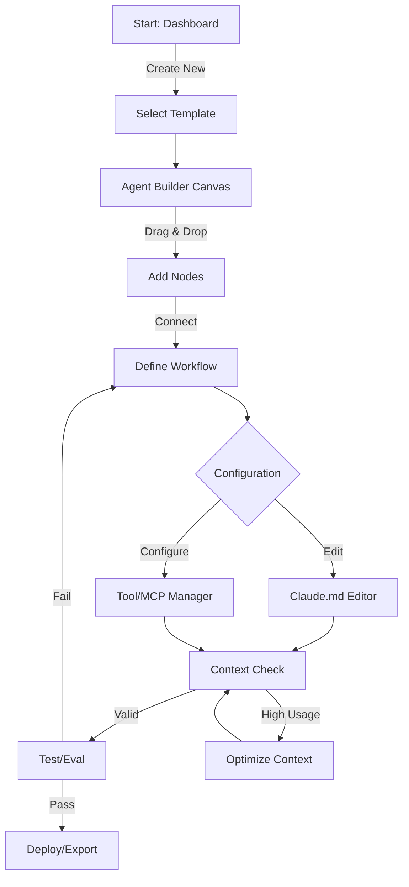

# Design Specification - Claude Code Agent Builder

## 1. Direction & Rationale
**Style:** **Modern Minimalism Premium (Dark Mode First)**
**Rationale:** Target users are professional developers who work in dark IDEs (VS Code, Cursor) for long hours. The aesthetic should mirror the precision of high-end dev tools (Linear, Raycast, Vercel)—using deep dark backgrounds to reduce eye strain, subtle borders for structure, and vibrant syntax-highlighting colors for cognitive clarity.
**Essence:** Precision, Depth, Focus.
**References:** Linear (interactions), Figma (canvas), VS Code (editor).

## 2. Design Tokens

### 2.1 Color Palette (Dark Mode Optimized)
| Token | Value (Ref) | Usage |
|-------|-------------|-------|
| **Backgrounds** | | |
| `bg-canvas` | #09090B (Zinc 950) | Main canvas infinite background |
| `bg-surface` | #18181B (Zinc 900) | Panels, cards, sidebars |
| `bg-surface-elevated` | #27272A (Zinc 800) | Modals, dropdowns, hovering nodes |
| **Borders** | | |
| `border-subtle` | #27272A (Zinc 800) | Dividers, panel edges |
| `border-focus` | #52525B (Zinc 600) | Active inputs, selected items |
| **Primary** | | |
| `primary-main` | #6366F1 (Indigo 500) | Primary actions, active states, key nodes |
| `primary-glow` | rgba(99, 102, 241, 0.15) | Selection halos, active backgrounds |
| **Semantic** | | |
| `text-primary` | #FAFAFA (Zinc 50) | Headings, main content |
| `text-secondary` | #A1A1AA (Zinc 400) | Metadata, descriptions, placeholder |
| `success` | #10B981 (Emerald 500) | Passing tests, connected states |
| `warning` | #F59E0B (Amber 500) | Context warnings, non-critical errors |
| `danger` | #EF4444 (Red 500) | Errors, destructive actions, high context usage |

### 2.2 Typography
**Font Family:** `Inter` (UI), `JetBrains Mono` (Code).
**Scale (Major Third 1.25):**
- **Heading 1:** 24px / 32px (Bold) – Page Titles
- **Heading 2:** 20px / 28px (Semibold) – Panel Headers
- **Heading 3:** 16px / 24px (Semibold) – Section Headers
- **Body:** 14px / 20px (Regular) – Main UI Text
- **Small:** 12px / 16px (Medium) – Metadata, Labels, Code Snippets
- **Tiny:** 11px / 14px (Medium) – Badges, Node Ports

### 2.3 Spacing & Radius
**Grid:** 4pt base. Common values: 4, 8, 12, 16, 24, 32px.
**Radius:**
- `radius-sm`: 4px (Checkboxes, Tags)
- `radius-md`: 8px (Buttons, Inputs, Nodes)
- `radius-lg`: 12px (Modals, Cards)

### 2.4 Shadows & Depth
- `shadow-node`: `0 4px 6px -1px rgba(0, 0, 0, 0.3), 0 2px 4px -1px rgba(0, 0, 0, 0.15)`
- `shadow-elevated`: `0 20px 25px -5px rgba(0, 0, 0, 0.4), 0 10px 10px -5px rgba(0, 0, 0, 0.2)`
- `glow-active`: `0 0 0 2px rgba(99, 102, 241, 0.4)`

## 3. Core Components

### 3.1 Flow Nodes (The Building Blocks)
**Structure:** Header (Icon + Title + Status) + Body (Inputs/Outputs) + Footer (Metadata).
**Styling:**
- **Bg:** `bg-surface-elevated`
- **Border:** 1px solid `border-subtle`
- **Hover:** `border-focus`, slight lift (`translate-y-[-2px]`)
- **Selected:** `border-primary-main`, `shadow-node` + `primary-glow`
**Variants:**
- **Role Node (Purple):** Architect, Builder. Larger header.
- **Action Node (Blue):** ReadFile, Bash. Compact.
- **Logic Node (Gray):** If/Else, Loop. Minimalist.
**Ports:** Circular handles (8x8px), `bg-surface`, border `text-secondary`. Green on hover (valid connection).

### 3.2 Configuration Panel (Context Optimizer)
**Structure:** Tabbed interface (Properties, Claude.md, Tools).
**Claude.md Editor:**
- **Progressive Fields:** Accordions for WHAT, WHY, HOW.
- **Context Meter:** Visual bar at top showing estimated token usage.
  - Green (<10k), Amber (10k-50k), Red (>50k).
- **Validation:** Inline warning icons for empty critical fields.

### 3.3 Visual Terminal
**Structure:** Collapsible bottom panel.
**Styling:** Monospace font, `bg-black` (darker than surface).
**Content:**
- **Stream:** Colored logs (Cyan for inputs, Grey for outputs).
- **Input:** Standard shell prompt (`$ `).
- **Controls:** Clear, Copy, Expand/Collapse.

### 3.4 Navigation Toolbar
**Structure:** Floating island top-center or fixed top bar.
**Elements:**
- **Project Breadcrumbs:** Home > Project Name.
- **Actions:** Play (Green), Deploy (Purple), Share (Ghost).
- **Context HUD:** Mini-graph showing context window usage % in real-time.

## 4. Layout & Interaction Patterns

### 4.1 The Builder Layout (Desktop First)
**Grid Strategy:**
- **Left Sidebar (Library):** Fixed width (260px). Scrollable list of draggable nodes.
- **Center (Canvas):** Flexible (`flex-1`). Infinite pan/zoom. Dot grid background (opacity 0.1).
- **Right Panel (Inspector):** Resizable (default 320px, max 600px).
- **Bottom Panel (Terminal):** Collapsible, overlay or stacked.

### 4.2 Drag & Drop Workflow
1.  **Drag:** User drags node from Library. Cursor changes to "grabbing".
2.  **Drop:** Node snaps to nearest 16px grid point on Canvas.
3.  **Connect:** Drag from Output Port -> Input Port. Line draws (Bézier curve). Snap assistance near valid ports.
4.  **Feedback:** Valid connection = Line turns Green. Invalid = Red + Shake animation.

### 4.3 Context Optimization Flow
1.  **Trigger:** User edits `claude.md` or adds MCP tool.
2.  **Feedback:** "Context Meter" updates instantly.
3.  **Optimization:** If usage > Threshold, show "Optimize" button.
4.  **Action:** Clicking "Optimize" runs compaction (removes verbose examples, suggests link references).

## 5. Interaction & Animation
**Performance:** GPU-accelerated transforms only.
**Durations:**
- **Hover/Click:** 150ms `ease-out`.
- **Panel Slide:** 250ms `cubic-bezier(0.16, 1, 0.3, 1)` (smooth deceleration).
- **Modal Fade:** 200ms `ease-out`.
**States:**
- **Running:** Nodes pulse (`opacity` 0.8 <-> 1.0).
- **Success:** Node border turns `success` (Green) flash.
- **Error:** Node border turns `danger` (Red) + Shake animation.

## 6. Accessibility & Responsiveness
**Keyboard Shortcuts:**
- `Space`: Pan canvas.
- `Cmd/Ctrl + Click`: Multi-select nodes.
- `Del`: Delete selected.
- `Cmd + Z`: Undo.
**Screen Readers:** Nodes use `aria-label="Node Type: Name"`. Connections described as list relationships.
**Responsive:**
- **Tablet:** Sidebars become drawers (overlays). Canvas supports touch pan/pinch-zoom.
- **Mobile:** Read-only view of status/logs. "Desktop required for editing".

## 7. Diagrams

### 7.1 User Flow: Building an Agent


### 7.2 Wireframe Schematic: Main Builder Interface
```mermaid
graph TB
    subgraph "Browser Window (100% w/h)"
        TB[Top Toolbar: Breadcrumbs | Context HUD | Actions (Run/Deploy)]
        
        subgraph "Workspace (Flex Row)"
            LB[Left Sidebar: Component Library]
            C[Main Canvas: Node Graph]
            RB[Right Panel: Configuration Inspector]
        end
        
        BTM[Bottom Panel: Terminal & Logs (Collapsible)]
    end
    
    TB --- Workspace
    Workspace --- BTM
    
    style TB fill:#27272A,stroke:#3F3F46
    style LB fill:#18181B,stroke:#27272A
    style C fill:#09090B,stroke:none
    style RB fill:#18181B,stroke:#27272A
    style BTM fill:#000000,stroke:#27272A
```
