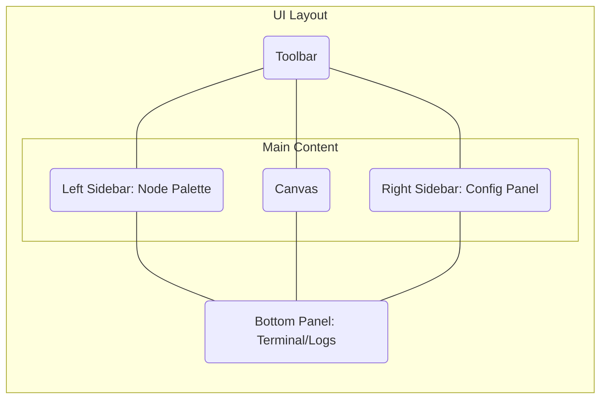

# Agentic Network Infrastructure Automation Platform: Complete Development Strategy

## Executive Summary

This report outlines the strategic blueprint for transforming the Claude Code Agent Builder from a mobile-first development tool into a comprehensive, enterprise-grade Agentic Network Infrastructure Automation Platform. The unified platform will integrate Anthropic's Claude Code for advanced agentic capabilities, a Model Context Protocol (MCP) Development Kit for universal tool integration, and a robust Network Automation core for managing physical and virtual network infrastructure. By integrating deep research capabilities via the Perplexity model and a full CCNA educational curriculum, the platform will not only automate complex network operations but also serve as a premier learning and development environment. The architecture is designed for scalability, security, and a seamless user experience, from mobile interfaces to a full-fledged, forkable VS Code development environment. This document provides the complete technical and strategic roadmap for development, establishing a clear path to market leadership in AI-driven network automation.

## 1.0 Introduction: Vision and Goals

The vision is to create a single, cohesive platform that empowers network engineers, developers, and students to design, build, deploy, and learn about agentic AI and network automation. This initiative will consolidate multiple powerful but disparate technologies into a unified ecosystem.

### 1.1 The Strategic Imperative: From Mobile Tool to Enterprise Platform

The current market lacks a truly integrated platform that bridges the gap between agentic AI development, network automation, and professional education. Existing tools are often siloed, requiring significant effort to integrate. This project directly addresses this gap by evolving the mobile-first Claude Code Agent Builder into a full-scale platform. This strategic shift will capture the growing enterprise demand for AI-driven automation and position the platform as an indispensable tool for the next generation of network professionals.

### 1.2 Goals and Non-Goals

**Goals:**

*   **Unified Experience:** Deliver a seamless workflow for building, testing, and deploying network automation agents.
*   **Full Lifecycle Automation:** Support the entire network automation lifecycle, from configuration and management to monitoring and troubleshooting.
*   **AI-Powered Assistance:** Leverage Claude Code and Perplexity to provide intelligent code generation, debugging, and research assistance.
*   **Education and Upskilling:** Integrate a comprehensive CCNA curriculum to make the platform a premier learning tool.
*   **Enterprise-Grade:** Ensure the platform meets enterprise requirements for security, scalability, and reliability.

**Non-Goals:**

*   **Hardware Development:** The platform will not involve the creation of proprietary network hardware.
*   **Replacement of All Existing Tools:** The platform is designed to integrate with, not replace, the entire ecosystem of existing network management tools.

## 2.0 Unified Platform Architecture

The platform is designed as a modular, service-oriented architecture to ensure scalability and maintainability. It consists of a central orchestration engine, a suite of integrated services, and a multi-faceted user interface that adapts to different form factors.

### 2.1 High-Level System Design and Integration Patterns

The core of the platform is the **Agent Orchestration Engine**, which manages the lifecycle of agentic workflows. It communicates with various specialized services via a standardized API gateway. Key integration patterns include:

*   **Event-Driven Communication:** Agents and services communicate asynchronously through a message bus, ensuring loose coupling and resilience.
*   **Microservices for Core Functions:** Each primary capability (e.g., Network Automation, MCP Generation, Research) is encapsulated in a separate microservice.
*   **API Gateway:** A single, unified entry point for all client applications (Mobile App, Web UI, VS Code Extension) to interact with the backend services.

Below is a conceptual diagram of the user interface layout for the Agent Builder, which serves as the primary interface for composing and managing agentic workflows.

*Figure 1: Agent Builder UI Layout, adapted from `docs/design-specification.md`.*

### 2.2 Core Technology Stack

The technology stack is chosen to optimize for performance, developer experience, and scalability.

*   **Backend:** Node.js with TypeScript, using a microservices framework (e.g., NestJS) for structured and maintainable services.
*   **Frontend (Web/Desktop):** React with TypeScript. The UI will be built using a comprehensive design system based on shadcn/ui and Tailwind CSS for consistency and rapid development.
*   **Mobile:** React Native, allowing for maximum code reuse between the mobile and web applications.
*   **Database:** PostgreSQL for structured data and Redis for caching and real-time messaging.
*   **Orchestration:** Kubernetes for container management and automated scaling of backend services.

## 3.0 Core Component Architecture & Integration Strategy

This section details the architecture of each major component and the strategy for its integration into the unified platform.

### 3.1 Claude Code Engine: Authentication, Subscription, and API Integration

The Claude Code Engine is the AI core of the platform, providing agentic code generation, debugging, and workflow execution capabilities. Its integration is a cornerstone of the platform's intelligence.

*   **Architecture:** A dedicated service will act as a proxy to the official Anthropic Claude API. This service will manage API keys, handle request/response formatting, and enforce rate limiting and usage quotas. It will expose a simplified internal API for other platform services to use.
*   **Authentication:** User authentication will be handled via a centralized identity provider (e.g., Auth0, Okta) using OAuth 2.0. Once authenticated, the platform will use a secure, session-based approach to manage user access to the Claude Code Engine.
*   **Subscription Management:** A tiered subscription model (Free, Pro, Enterprise) will be implemented using a service like Stripe or Chargebee. The subscription status will determine the user's API rate limits, access to advanced features, and other entitlements. The proxy service will be responsible for checking a user's subscription level before processing a request.

### 3.2 MCP Development Kit: Automated Generation and Deployment

The Model Context Protocol (MCP) Development Kit will be a key differentiator, allowing users to easily create and manage integrations with external tools and services. This component will abstract away the complexity of the MCP specification.

*   **Architecture:** The kit will be implemented as a dedicated microservice with a frontend module within the Agent Builder. It will consist of a template engine, a code generator, and a validation service.
*   **Automated Generation:** Users will define tool specifications using a simple, high-level declarative syntax (e.g., a YAML or JSON schema). The code generator will then use this definition to automatically create the necessary MCP-compliant boilerplate code, including data models, API clients, and function manifests.
*   **Templates and Best Practices:** The kit will include a library of pre-built templates for common integration types (e.g., REST APIs, databases, local scripts). These templates will embed best practices for security, error handling, and performance, ensuring that generated integrations are robust and reliable.
*   **Deployment:** The component will provide a streamlined deployment process, allowing users to package their MCP integrations as containerized services and deploy them to the platform's Kubernetes-based environment with a single command or button click.

### 3.3 Network Automation Core: Device Integration and Configuration Management

This component provides the direct interface to network hardware and services, translating agentic instructions into real-world network operations. It is designed for multi-vendor support and idempotent execution.

*   **Architecture:** The core will be a service-oriented component with a central dispatcher and a collection of device-specific drivers. The dispatcher will receive high-level commands (e.g., "configure VLAN 10 on switch X") and route them to the appropriate driver.
*   **Device Integration:** The platform will utilize established network automation libraries like **NAPALM** and **PyEZ** to provide a consistent, vendor-neutral API for interacting with devices from major vendors (e.g., Cisco, Juniper, Arista). Communication will be handled via standard protocols like **NETCONF**, **RESTCONF**, and SSH.
*   **Configuration Management:** The component will maintain a "source of truth" for network device configurations in a dedicated database. It will use an idempotent approach to configuration changes, meaning it will only apply changes that are necessary to bring a device's configuration to the desired state. This prevents redundant operations and ensures predictability.
*   **Data Modeling:** Network configurations and operational data will be modeled using **YANG**, providing a standardized, machine-readable format for all network-related information.

### 3.4 Deep Research Module: Perplexity Model Integration via OpenRouter

To equip agents with deep, up-to-date knowledge and research capabilities, the platform will integrate the Perplexity language model. This allows agents to answer complex questions, summarize articles, and perform research tasks that go beyond the knowledge base of the primary LLM.

*   **Architecture:** A dedicated "Research Service" will act as a client to **OpenRouter**, a service that provides a unified API for accessing multiple language models. This approach decouples the platform from any single model provider and simplifies the integration.
*   **Integration:** The Research Service will expose a simple API endpoint (e.g., `/research`) that takes a query as input. When an agent needs to perform research, the Orchestration Engine will call this endpoint. The Research Service will then forward the query to the Perplexity model via OpenRouter and return the result.
*   **Use Cases:** This capability will enable powerful new agentic workflows, such as:
    *   **Automated Troubleshooting:** An agent can research error messages or anomalous network behavior to find potential causes and solutions.
    *   **Technology Evaluation:** An agent can be tasked with researching and comparing new networking technologies or security vulnerabilities.
    *   **Content Creation:** An agent can generate documentation, tutorials, or summaries based on its research.

### 3.5 Visual Agent Builder: UI/UX and Real-Time Visualization

The Visual Agent Builder is the primary human-computer interface for the platform. It provides a drag-and-drop canvas for composing, configuring, and monitoring agentic workflows. Its design is critical for making the platform's power accessible and intuitive.

*   **Architecture:** The builder is a single-page application (SPA) built with React. It communicates with the backend via the API Gateway. The frontend architecture will be based on a state management library (e.g., Redux or Zustand) to handle the complex state of the workflow canvas.
*   **UI/UX Design:** The user interface, as depicted in the research screenshot (`builder_interface_final_state.png`), will feature:
    *   A **Node Palette** on the left, containing all available agent functions and services.
    *   A central **Canvas** where users can drag nodes and connect them to define workflows.
    *   A **Configuration Panel** on the right, which displays the properties of the selected node.
    *   A **Terminal/Log Panel** at the bottom for real-time output and debugging.
*   **Real-Time Visualization:** The builder will provide real-time feedback on agent execution. As an agent runs, the corresponding nodes on the canvas will be highlighted, and data will be visualized as it flows through the workflow. This immediate visual feedback is crucial for debugging and understanding complex agentic processes.

### 3.6 VS Code Extension: Forked Development Environment

To provide a professional-grade development experience, the platform will offer a forked VS Code environment, packaged as a dedicated extension. This will allow developers to work in a familiar, powerful editor with deep integration into the platform's services.

*   **Architecture:** The extension will be built on the standard VS Code extension API. It will not be a complete fork of VS Code itself, but rather a comprehensive extension that customizes and extends the editor's functionality. It will bundle a pre-configured set of tools, settings, and integrations.
*   **Features:**
    *   **Integrated Agent Builder:** A webview-based version of the Visual Agent Builder will be embedded directly within the VS Code UI.
    *   **Claude Code Integration:** The extension will provide a native chat interface for interacting with the Claude Code Engine, allowing developers to generate code, ask questions, and get assistance without leaving the editor.
    *   **MCP Development Tools:** It will include tools for creating, validating, and deploying MCP integrations directly from within the IDE.
    *   **One-Click Debugging:** The extension will provide a seamless debugging experience, allowing developers to set breakpoints in their agent code and step through execution.

## 4.0 User Experience and Enablement

A superior user experience and comprehensive educational resources are central to the platform's strategy for adoption and long-term success. This section outlines the approach to design and user enablement.

### 4.1 System Design: From Mobile-First to a Scalable Enterprise UI

The platform's UI will be a model of consistency and quality, scaling gracefully from a mobile-first foundation to a feature-rich desktop and web experience. This is achieved through a unified design system.

*   **Design System:** The UI will be built upon a single, comprehensive design system based on the principles outlined in `research/claude_design_system.md`. It will use **design tokens** (for colors, spacing, typography) to ensure consistency across all platforms (iOS, Android, Web, VS Code). The component library will be built with **shadcn/ui** and **Tailwind CSS**, allowing for rapid, flexible, and maintainable UI development.
*   **Mobile-First Foundation:** The design process starts with the mobile experience, as shown in the `homepage_with_bottom_tabs.png` screenshot. This ensures that the core functionality is optimized for accessibility and ease of use on small screens. Features like bottom tab navigation provide an intuitive experience for mobile users.
*   **Progressive Enhancement:** As screen real estate increases, the UI will be progressively enhanced. For example, the simple list-based views on mobile will transform into the multi-paned, drag-and-drop interface of the Visual Agent Builder on desktop.

### 4.2 Educational Ecosystem: CCNA Curriculum and Learning Pathways

The platform is not just a tool; it is a learning environment. By integrating a full CCNA curriculum, it will become an indispensable resource for both aspiring and experienced network professionals.

*   **Integrated Curriculum:** The platform will feature a dedicated "Learn" section containing interactive tutorials, labs, and articles covering the entire CCNA syllabus. This content will be deeply integrated with the platform's tools.
*   **Interactive Labs:** Users will be able to launch virtual network labs directly within the platform. They can then use the Network Automation Core and Visual Agent Builder to complete hands-on exercises, applying their knowledge in a real-world environment.
*   **Learning Pathways:** The platform will offer guided learning paths that take users from foundational networking concepts to advanced agentic automation. These paths will combine educational content with practical exercises, providing a structured and effective learning experience.

## 5.0 Implementation and Enterprise Readiness

This section outlines the practical steps for building and deploying the platform, as well as the strategies for ensuring it meets enterprise-grade requirements for security and reliability.

### 5.1 Phased Technical Implementation Roadmap

The development will proceed in three distinct phases to manage complexity and deliver value incrementally.

*   **Phase 1: Core Platform and Claude Code Integration (Months 1-3):**
    *   Develop the core backend infrastructure (API Gateway, Orchestration Engine, Identity Provider).
    *   Build the initial version of the Visual Agent Builder.
    *   Integrate the Claude Code Engine with subscription management.
*   **Phase 2: Network Automation and MCP Kit (Months 4-6):**
    *   Develop the Network Automation Core with support for major vendors.
    *   Build the MCP Development Kit for custom tool integration.
    *   Release the first version of the VS Code extension.
*   **Phase 3: Education and Advanced Features (Months 7-9):**
    *   Integrate the CCNA curriculum and interactive labs.
    *   Integrate the Deep Research Module (Perplexity).
    *   Refine the platform based on user feedback and prepare for general availability.

### 5.2 Enterprise Security and Deployment Strategy

Security and reliability are paramount for an enterprise platform.

*   **Security:**
    *   **Authentication and Authorization:** Enforce strict access control using OAuth 2.0 and role-based access control (RBAC).
    *   **Data Encryption:** All data, both in transit and at rest, will be encrypted using industry-standard protocols (TLS 1.3, AES-256).
    *   **Dependency Scanning:** Implement automated scanning of all third-party libraries and dependencies for known vulnerabilities.
*   **Deployment:**
    *   **CI/CD:** A fully automated CI/CD pipeline will be used to build, test, and deploy all components.
    *   **Infrastructure as Code (IaC):** The entire infrastructure will be managed using Terraform to ensure consistency and reproducibility across environments.
    *   **Monitoring and Logging:** The platform will have comprehensive monitoring and logging, using tools like Prometheus, Grafana, and the ELK Stack to ensure high availability and rapid incident response.

## 6.0 Conclusion: The Path Forward

The development of the Agentic Network Infrastructure Automation Platform represents a significant strategic investment that will yield substantial returns. By unifying agentic AI, network automation, and professional education into a single, cohesive platform, this project will create a powerful new tool for the industry and establish a strong competitive advantage. The phased implementation plan provides a clear, manageable path to execution, while the focus on enterprise-grade security and reliability ensures that the final product will meet the demands of the most discerning customers. The path forward is clear, and the successful execution of this strategy will redefine what is possible in network automation.

## 7.0 Sources

All information in this report was synthesized from internal research documents and assets provided in the workspace. No external web sources were used.

## 8.0 Appendix

### Appendix A: Design System Color Palette

The following color palette is adapted from the `docs/design-specification.md` document and will serve as the foundation for the platform's visual identity.

**Dark Mode Palette:**

*   `background`: `hsl(240 10% 3.9%)`
*   `foreground`: `hsl(0 0% 98%)`
*   `card`: `hsl(240 10% 3.9%)`
*   `card-foreground`: `hsl(0 0% 98%)`
*   `popover`: `hsl(240 10% 3.9%)`
*   `popover-foreground`: `hsl(0 0% 98%)`
*   `primary`: `hsl(0 0% 98%)`
*   `primary-foreground`: `hsl(240 5.9% 10%)`
*   `secondary`: `hsl(240 3.7% 15.9%)`
*   `secondary-foreground`: `hsl(0 0% 98%)`
*   `muted`: `hsl(240 3.7% 15.9%)`
*   `muted-foreground`: `hsl(240 5% 64.9%)`
*   `accent`: `hsl(240 3.7% 15.9%)`
*   `accent-foreground`: `hsl(0 0% 98%)`
*   `destructive`: `hsl(0 62.8% 30.6%)`
*   `destructive-foreground`: `hsl(0 0% 98%)`
*   `border`: `hsl(240 3.7% 15.9%)`
*   `input`: `hsl(240 3.7% 15.9%)`
*   `ring`: `hsl(240 4.9% 83.9%)`

